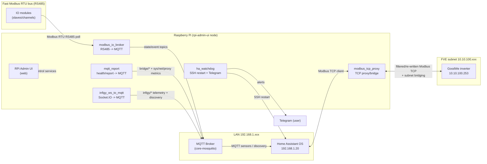

# RPi Admin UI & Services

Komplexní řešení pro Raspberry Pi, které zajišťuje:
- sběr a publikaci dat do MQTT,
- integraci s Home Assistantem,
- watchdog a dohled nad dostupností služeb,
- správu Modbus komunikace,
- centrální webové administrační UI.

---

## Cíle

Projekt jsem vyvinul, abych zajistil zdroje informací pro domácí Home Assistant v těchto oblastech:
- korektní komunikaci s invertorem FVE GoodWe prostřednictvím MODBUS včetně zajištění propojení 2 lokálních sítí (LAN s Home Assistant a wifi s invertorem GoodWe)
- načítání informací o FVE vytěžováním řídícího systému Infigy
- obsluhu "rychlé" samostatné sběrnice RS485 MODBUS mimo Home Assistant (limit poolování v řádech sekund), na které jsou připojeny io moduly pro snímání stavů vypínačů a tlačítek a přenos do MQTT a následně do Home Assistant
- nastavování realizovaných služeb prosřednictvím webového UI a konfiguračního souboru .env
- zveřejňování stavů Raspberry Pi3B, na lterém běží služby, prostřednictvím MQTT do HA
- hlídání dostupnusti Home Assistatn a v případě, že přestané odpovídat poslat alert zpávu na účet Telegram a zavolání restartu Home Assistant


## Architektura systému



---


## Přehled služeb
Tento repozitář obsahuje několik samostatných služeb, které dohromady tvoří monitorovací, integrační a administrační ekosystém pro Raspberry Pi, Home Assistant, Modbus a MQTT.

Každá služba má **vlastní detailní dokumentaci** ve formátu Markdown ve stejném adresáři jako tento soubor.
### rpi-admin-ui
Webové administrační rozhraní:
- editace `.env` konfigurace,
- start/stop/restart systemd služeb,
- mazání MQTT retained konfigurací (HA Discovery cleanup)
- diagnostika stavu systému.

[README UI.md](README%20UI.md)

### mqtt-report
Periodický reporting stavu Raspberry Pi:
- systémové metriky,
- síťová dostupnost,
- MQTT + HA discovery.

[README Report.md](README%20Report.md)

### modbus_tcp_proxy
TCP proxy pro Modbus komunikaci s invertorem GoodWe:
- stabilizace spojení,
- řešení TID/UID,
- oddělení sítí.

[README Modbus TCP Proxy.md](README%20Modbus%20TCP%20Proxy.md)

### infigy_ws_to_mqtt
Přenos dat z platformy Infigy do MQTT:
- stavové hodnoty parametrů FVE,
- heartbeat / watchdog informace,
- MQTT + HA discovery.

[README Infigy.md](README%20Infigy.md)

### modbus_io_broker
Modbus RTU → MQTT broker pro IO zařízení (RS-485):
- čte digitální vstupy / výstupy z IO modulů po rychlé sběrnici RS-485,
- podporuje polling, debounce a mapování kanálů,
- transformuje fyzické IO signály na MQTT

[README Modbus IO Broker.md](README%20Modbus%20IO%20Broker.md)

### ha_watchdog
Watchdog Home Assistantu:
- kontrola dostupnosti,
- restart HA přes SSH,
- Telegram notifikace.

[README HA Watchdog.md](README%20HA%20Watchdog.md)

---

## Uživatelské requirements

- Telegram účet + bot
- MQTT broker
- Povolené SSH na HA
- Správně nastavený Modbus
- Instalace Tailscale na RPi (volitelné pro zajištění přístupu ovládání i mimo lokální síť)

---

## Instalace

1. **Stažení a spuštění instalačního skriptu**:

```bash
curl -fsSL https://raw.githubusercontent.com/pavlosdr/rpi-tcp-proxy/master/download/Rpi_Admin_Ui_Setup.sh -o Rpi_Admin_Ui_Setup.sh
chmod +x Rpi_Admin_Ui_Setup.sh
./Rpi_Admin_Ui_Setup.sh
```

2. **Co skript provádí**:

- Instaluje systémové závislosti (unzip, curl, Flask, pip, fping, atd.)
- Stáhne archiv `rpi-tcp-proxy-no-git.zip` ze zadané URL
- Rozbalí soubory do `/opt/rpi-admin-ui`
- Nainstaluje Python závislosti z `requirements.txt`
- Zaregistruje a spustí systemd služby:
  - `rpi-admin-ui.service` 
  - `modbus_tcp_proxy.service`
  - `rpi-mqtt-report.service`
  - `ha_watchdog.service`
  - `infigy_ws_to_mqtt.service`
  - `modbus_io_broker.service` 

---

## Přístup k webovému rozhraní

Po dokončení instalace otevři webový prohlížeč a přejdi na:

```
http://<IP_adresa_Raspberry_Pi>:8080
```

Příklad:

```
http://192.168.1.42:8080
```
Přihlašovací údaje jsou uloženy v  `.env`
Přihlašovací údaje:
- **Uživatel:** `admin`
- **Heslo:** `raspberry` *(lze změnit v `.env` souboru)*
---

## Opakovaná instalace nebo aktualizace

Pokud chceš systém přeinstalovat nebo aktualizovat:

```bash
./Rpi_Admin_Ui_Setup.sh
```

Skript vše provede automaticky — staré soubory odstraní a nasadí nové.

---

## Sestavení ZIP balíčku z Git repozitáře (Windows)

V adresáři tools\ spusť skript:
```
generate_deploy_zip_from_git.bat
```

Tento skript provede:

- Vytvoření složky `C:\Git\rpi-tcp-proxy\download` (pokud neexistuje)
- Vygenerování archivu `rpi-tcp-proxy-no-git.zip` bez pomocných souborů (`.git`, `tools/`, `download/`, atd.)
- Pokud ve složce zip již existoval, smaže jej a nahradí novým

ZIP můžeš následně nahrát na vlastní web a použít pro instalaci přes `Rpi_Admin_Ui_Setup.sh`.

---

## Struktura projektu 

```
rpi-tcp-proxy/
├── config/
│   └── agendas.py
├── download/
│   ├── Rpi_Admin_Ui_Setup.sh
│   └── rpi-tcp-proxy-no-git.zip
├── static/
│   └── style.css
├── templates/
│   ├── macros/
│   │   ├── fields.html
│   │   └── service_status.html
│   ├── agenda_env.html
│   ├── base.html
│   ├── index.html
│   ├── login.html
│   ├── network.html
│   ├── service.html
│   ├── service_detail.html
│   ├── services.html
│   └── settings_mqtt_discovery.html
├── systemd/
│   ├── ha_watchdog.service
│   ├── infigy_ws_to_mqtt.service
│   ├── modbus_io_broker.service
│   ├── modbus_tcp_proxy.service
│   ├── rpi-admin-ui.service
│   └── rpi-mqtt-report.service
├── tools/
│   ├── generate_deploy_zip_from_git.bat
│   ├── generate_deploy_zip_from_git.ps1
│   └── sudoers.txt
├── .env
├── .gitattributes
├── .gitignore
├── agenda_env.py
├── app.py
├── auth.py
├── envfile.py
├── ha_watchdog.py
├── infigy_ws_to_mqtt.py
├── modbus_io_broker.py
├── modbus_tcp_proxy.py
├── monitor.py
├── mqtt_report.py
├── mqtt_tools.py
├── README.md
├── README HA Watchdog.md
├── README Infigy.md
├── README Modbus IO Broker.md
├── README Modbus TCP Proxy.md
├── README Report.md
├── README UI.md
├── requirements.txt
└── services_control.py
```

---

## Instalační adresáře na Raspberry:
- `\opt\rpi-admin-ui` >>> adresář projektu
- `\etc\systemd\system\` >>> adresář se soubory *.service **(POZOR, nelze přímo modifikovat a je potřeba otevřít interní editor)**
---
## Konfigurace služeb

Hodnoty v `.env` lze měnit přímo ve webovém rozhraní v sekci **„Služby“**, která je dostupná z horizontálního menu. Každá služba má tlačítko `Upravit konfiguraci`. Zadané, upravené hodnoty parametrů se uloží tlačítkem `Uložit do .env`. Následně je potřebné restartovat službu, u které došlo ke změně parametrů tlačítkem `Restartovat`.
 
## UI rozhraní
Webové rozhraní se ovládá pomocí horizontálního menu s těmito volbami:
- Dashboard >>> přehled základních síťových hodnot pro Raspberry (adresy, sítě, ...)
- Služby >>> hlavní řídící okno se seznamem služeb a možností jejich konfigurace
- Síť >>> síťové testy
- Nastavení >>> Nastavení služby UI a MQTT Discovery nastavení

### Dashboard
Zobrazuje systémové informace:
- hostname Raspberry Pi
- IP adresy všech síťových rozhraní Raspberry
- wifi SSID
- síla signálu wifi
- uptime - jak dlouho systém běží od posledního restartu
- loadavg - kolik práce systém nestíhá *)
- teplota CPU Raspberry
- Tailscale status (všechna zařízení v síti Tailscale)

*)- průměrné hodnoty za 1, 5 a 15 minut. `Load average` udává, kolik procesů chce v daný okamžik používat CPU
(nebo čeká na I/O – disk, síť) == kolik práce systém nestíhá zpracovat okamžitě.
Load ≈ počet CPU jader = systém je akorát vytížený

### Služby
Seznam instalovaných služeb s uvedením stavu (`Active`, `Inactive`)
U každé služby jsou k dispozici ovládací tlačítka:
- `Start` / `Stop` - spuštění a zastavení služby
- `Restartovat` - restart služby
- `Upravit konfiguraci` - nastavení parametrů služby a jejich uloženo konfiguračního souboru `.env`
- `Detail služby` - zobrazení žurnálů služby (status a posledních x řádků žurnálu journactl)

### Síť
Několik síťových testů a testů služeb:
- `Ping testy z RPi` - ping z Raspberry na různé adresy v síti
- `iPerf3 test` - doplňkový test, není použitelný pro Home Assistant, který ho nepodporuje (je nutné doinstalovat add-on na HA)
- `MQTT latency test` - spustí N vzorků v časovém intervalu: publish > MQTT broker > recieve. Parametry testu se nastavují v konfiguraci (je dostupné tlačítku, které zobrazí přímo sekci pro nastavení testu)
- `Modbus RTT test (RTU) - servisní` - měří čistou odezvu sběrnice RS485 Modbus připojenou k Raspberry. Aby test byl korektní, je potřeba zastavit službu `modbus_io_broker.service`. Slouží pro ověření správného zapojení, časování, počtu modulů na sběrnici. Parametry testu se nastavují v konfiguraci (je dostupné tlačítku, které zobrazí přímo sekci pro nastavení testu)
- `Statistiky rozhraní` - počítané statisky síťových rozhraní Rasberry

### Nastavení
Lze odtud spustit konfiguraci uživatelského rozhraní Raspberry (stejná konfigurace je dostupná i ze služeb) a nastavení `MQTT Discovery`.

**MQTT Discovery**
smaže retained MQTT Discovery konfigurační zprávy tím, že na stejné discovery topicy publikuje „prázdnou“ zprávu s retain=True. MQTT broker tím retained zprávu odstraní a Home Assistant pak přestane dané entity z MQTT Discovery „vidět“ (po reloadu integrace / restartu / dalším discovery cyklu).
**MQTT Discovery config (retained)**
Home Assistant MQTT Discovery používá konfigurační topicy ve tvaru:

```bash
homeassistant/<domain>/<device_id>/<object_id>/config
```
Tyto zprávy bývají **retained**, aby:
- HA mohl entity obnovit i po restartu,
- a aby HA „našel“ entity i když se připojí později než publisher.

Když tedy jednou publikuješ discovery config a necháš ho retained, broker ho bude držet „navždy“, dokud ho:
- nepřepíšeš novou konfigurací na stejný topic, nebo
- **nesmažeš** (viz níže).

**Jak se maže retained zpráva v MQTT**
Mazání se provádí tak, že na stejný topic publikuješ:
- `payload = None` (nebo prázdný payload)
- `retain = True`

Broker tím dostane pokyn: „retained zprávu pro tento topic smaž“.

To přesně dělá tvoje funkce `mqtt_delete_retained_discovery()`:
- pro každý topic zavolá `client.publish(t, payload=None, qos=1, retain=True)`

**Jak funguje tvoje UI: List a Clean-up**
1) **List:** `mqtt_list_retained_discovery(...)`

UI nejdřív „nasbírá“ retained discovery zprávy tak, že se přihlásí na broker a udělá subscribe na:
- pokud zadáš `device_id`:`homeassistant/+/<device_id>/+/config`
- jinak: `homeassistant/+/+/+/config`

a po dobu `window_s` sbírá přijaté retained configy do seznamu. 

**Význam polí v UI:**

- **Služba**: předvyplní MQTT připojení (host/port/user/pass/prefix) podle .env a mapování v aplikaci.
- **Contains (volitelné)**: filtruje jen topicy, které v názvu obsahují zadaný podřetězec (např. bridge, modbus_io_128).
- **Window (s)**: jak dlouho po subscribe sbíráš retained zprávy (typicky 1–3 s stačí).
- **Limit**: bezpečnostní limit, kolik topiců max nasbírat.

Poznámka: UI neověřuje „retained = yes“ jako podmínku, ale discovery configy v praxi retained jsou. U tebe je to v tabulce vidět. 

2) **Clean-up**: `mqtt_cleanup_discovery_for_device(...)`

Clean-up udělá:
- List (najde topicy)
- Z nich poskládá seznam topiců
- Pro každý topic publikuje `payload=None` s `retain=True` (mazání)
- Vrátí počet  `found` a `deleted`

**Proč se ti to hodí v praxi**

Použiješ to typicky když:
- změnil ses ve struktuře entity / názvech / unique_id
- testoval jsi discovery a v brokeru zůstaly „mrtvé“ entity
- chceš udělat čistý restart konfigurace pro jedno zařízení (device_id)

Je to správný přístup – jen je dobré uživatele varovat, že:
- po smazání retained configu mohou entity v HA zmizet (nebo být „unavailable“)
- a znovu se objeví až po tom, co služba znovu publikuje discovery config.

**Důležitý praktický detail: oprávnění na brokeru**

`Connection Refused: not authorised.`

To znamená, že pro mosquitto_sub (a stejně tak pro UI mazání) musíš použít správné credentials (u tebe typicky `mqtt_bridge / mqtt_password` podle .env pro konkrétní službu).

Pro ruční ověření:
```bash
mosquitto_sub -h 192.168.1.20 -p 1883 -u mqtt_bridge -P 'mqtt_password' -v -t 'homeassistant/#'
```
Když tohle nepůjde, UI list/cleanup také nebude fungovat (protože používá stejné připojení přes Paho). 


## Licence
MIT
